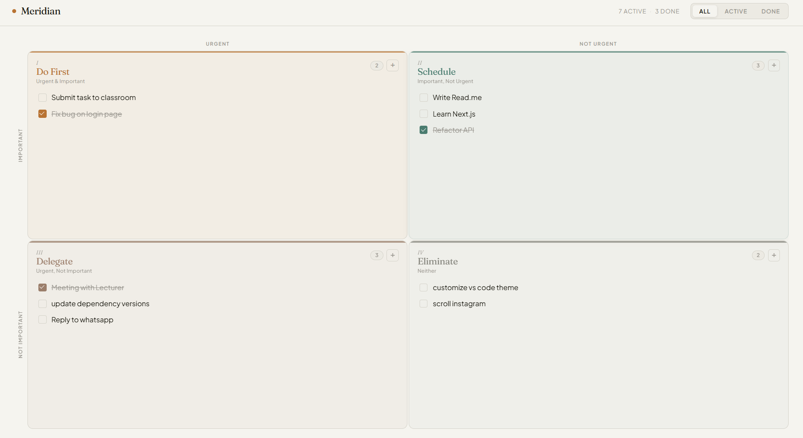

<div align="center">

# Meridian

### *Berpikir jernih. Bekerja terarah. Tanpa kebisingan visual.*

Aplikasi manajemen tugas berbasis Eisenhower Matrix yang membantu Andamemprioritaskan hal-hal yang benar-benar penting dan membedakannya dari tugas yang sekadar mendesak.

<br/>


<br/>

<!-- Tambahkan screenshot atau demo GIF di sini -->
<!--  -->

## [🔗 Live Demo](https://meridian-ndrk.vercel.app/) ##

</div>


## Why?

Setiap hari pasti kita dibombardir dengan tugas kuliah, kerjaan dan notifikasi yang bikin kita tambah sibuk dan tambah stress, yang membuat kita kurang produktif. Kita sering stuck mengerjakan hal yang kelihatannya urgent, padahal belum tentu penting. 

Di sinilah Eisenhower Matrix dibutuhkan. Konsep ini membagi task berdasarkan tingkat urgensi dan kepentingannya, jadi kita bisa langsung tahu mana yang harus dieksekusi sekarang, dijadwalkan, dilempar ke orang lain, atau malah diabaikan saja.

dari sisi teknis, proyek ini merupakan hasil refactor menyeluruh dari basis kode yang ada. Kode lama dianalisis, diurai, dan dibangun ulang dari nol menggunakan arsitektur komponen yang benar-benar modular: setiap lapisan (tipe data, konstanta, hooks, context, dan UI) memiliki tanggung jawab tunggal dan batas yang jelas. Hasilnya adalah kode yang tidak hanya bekerja dengan baik, tetapi juga mudah dibaca, dipelihara, dan dikembangkan lebih lanjut.

---
## Fitur Utama

- Memisahkan Task berdasarkan sistem urgent dan important, bukan cuma sekedar ganti label teks seperti di aplikasi to-do list pada umumnya.

- Semua task tersimpan otomatis di `localStorage`; data tetap ada meskipun halaman di-refresh

- Desain Minimalist, tidak ada gradien berlebihan, tidak ada ikon yang tidak perlu

- Tambah Task Tanpa Ribet, Tinggal klik tombol + di kuadran yang diinginkan, dan tugas otomatis masuk ke kategori yang tepat.

- Filter Instan (No Reload), Bisa menampilkan semua tugas, hanya yang aktif, atau hanya yang selesai tanpa reload halaman

- Mudah menghapus suatu task dengan hanya mengarahkan kursor dan hover ke tugas, jadi tampilan layar tetap bersih saat sedang fokus.


---

## Panduan Instalasi

```bash
# 1. Clone repositori ini
git clone https://github.com/username/meridian.git
cd meridian

npm install


npm run dev
```

Buka [http://localhost:3000](http://localhost:3000) di browser.
